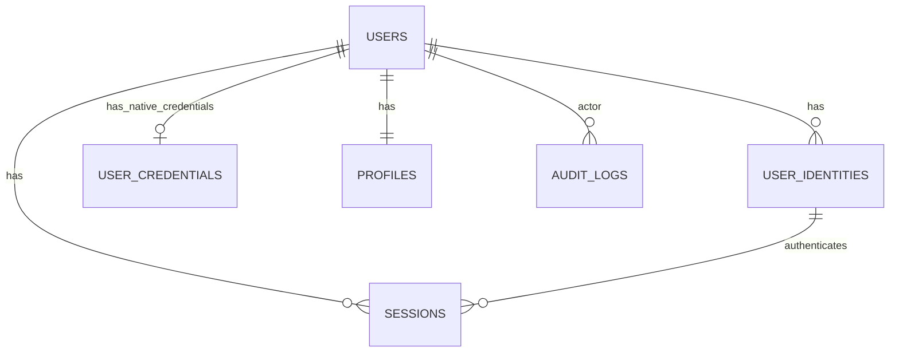

# Data Schema and Data Flow

Date: February 18, 2026

## 1) Design Principles
- One canonical user record per person.
- Multiple login providers map to one user.
- Password credentials are only for native identities.
- Sessions are persisted and revocable.
- JWT subject is always `user_id` (stable identity).

## 2) Entity Relationship Overview

## 3) Tables

### `users`
Purpose: Canonical account record.

Fields:
- `id` UUID PK
- `role` ENUM(`root_admin`,`admin`,`user`) NOT NULL DEFAULT `user`
- `status` ENUM(`active`,`disabled`,`pending`) NOT NULL DEFAULT `active`
- `created_at` TIMESTAMP NOT NULL
- `updated_at` TIMESTAMP NOT NULL
- `disabled_at` TIMESTAMP NULL

Indexes/constraints:
- PK on `id`
- Index on `role`
- Index on `status`

### `user_identities`
Purpose: Login methods attached to a user.

Fields:
- `id` UUID PK
- `user_id` UUID FK -> `users.id`
- `provider` ENUM(`native`,`google`,`facebook`) NOT NULL
- `provider_user_id` VARCHAR(255) NOT NULL
- `email` VARCHAR(255) NULL
- `email_verified` BOOLEAN NOT NULL DEFAULT `false`
- `created_at` TIMESTAMP NOT NULL
- `last_login_at` TIMESTAMP NULL

Indexes/constraints:
- FK index on `user_id`
- UNIQUE(`provider`, `provider_user_id`)
- Optional UNIQUE(`provider`, `email`) when provider guarantees verified uniqueness

### `user_credentials`
Purpose: Password storage for native auth only.

Fields:
- `user_id` UUID PK FK -> `users.id`
- `password_hash` TEXT NOT NULL
- `password_updated_at` TIMESTAMP NOT NULL
- `must_reset_password` BOOLEAN NOT NULL DEFAULT `false`

Indexes/constraints:
- One-to-one via PK/FK on `user_id`

### `profiles`
Purpose: User profile attributes for app usage.

Fields:
- `user_id` UUID PK FK -> `users.id`
- `given_name` VARCHAR(100) NOT NULL
- `family_name` VARCHAR(100) NOT NULL
- `nick_name` VARCHAR(100) NULL
- `picture_url` VARCHAR(512) NULL
- `locale` VARCHAR(32) NULL
- `updated_at` TIMESTAMP NOT NULL

Indexes/constraints:
- One-to-one via PK/FK on `user_id`

### `sessions`
Purpose: Track login sessions and refresh lifecycle.

Fields:
- `id` UUID PK
- `user_id` UUID FK -> `users.id`
- `identity_id` UUID FK -> `user_identities.id`
- `refresh_token_hash` TEXT NOT NULL
- `jti` UUID NOT NULL
- `ip_address` VARCHAR(64) NULL
- `user_agent` VARCHAR(512) NULL
- `created_at` TIMESTAMP NOT NULL
- `expires_at` TIMESTAMP NOT NULL
- `revoked_at` TIMESTAMP NULL
- `revoked_reason` VARCHAR(128) NULL

Indexes/constraints:
- FK indexes on `user_id`, `identity_id`
- UNIQUE on `jti`
- Index on `expires_at`
- Index on `revoked_at`

### `audit_logs`
Purpose: Security and admin activity trace.

Fields:
- `id` BIGINT PK
- `actor_user_id` UUID FK -> `users.id`
- `action` VARCHAR(100) NOT NULL
- `target_type` VARCHAR(50) NOT NULL
- `target_id` VARCHAR(64) NULL
- `metadata_json` JSON NOT NULL
- `created_at` TIMESTAMP NOT NULL

Indexes/constraints:
- Index on `actor_user_id`
- Index on `action`
- Index on `created_at`

## 4) JWT Claims Contract (MVP)
Access token claims:
- `sub`: `users.id`
- `sid`: `sessions.id`
- `jti`: token ID
- `role`: user role
- `amr`: auth method reference (`native`, `google`, `facebook`)
- `iat`, `nbf`, `exp`, `iss`, `aud`

Refresh token claims:
- `sub`, `sid`, `jti`, `iat`, `nbf`, `exp`, `iss`, `aud`
- `token_type`: `refresh`

## 5) Data Flows

### A. Native Register Flow
1. Client sends username/email/password.
2. Server creates `users` row (`role=user`, `status=active`).
3. Server creates `user_identities` row (`provider=native`).
4. Server hashes password and stores in `user_credentials`.
5. Server creates default `profiles` row.
6. Server writes `audit_logs` event.

### B. Native Login Flow
1. Client sends native credentials.
2. Server resolves native identity from `user_identities`.
3. Server verifies password from `user_credentials`.
4. Server creates `sessions` row and issues access+refresh JWT.
5. Server stores hashed refresh token in `sessions`.
6. Server updates `last_login_at` in `user_identities`.
7. Server writes `audit_logs` event.

### C. Google/Facebook SSO Login Flow
1. Client completes provider OAuth and returns provider token/code.
2. Server validates token with provider and reads provider subject.
3. Server finds `user_identities` by (`provider`, `provider_user_id`).
4. If missing, server creates new `users` + `user_identities` (+ optional `profiles` seed).
5. Server creates `sessions` and issues JWT pair.
6. Server writes `audit_logs` event.

### D. Refresh Flow
1. Client sends refresh token.
2. Server validates JWT and checks `token_type=refresh`.
3. Server loads `sessions` by `sid` and checks not revoked/expired.
4. Server compares presented token hash with stored hash.
5. Server rotates refresh token hash and issues new token pair.
6. Server writes `audit_logs` event.

### E. Admin Management Flow
1. Root admin calls admin endpoint with access token.
2. Authz middleware checks `role=root_admin`.
3. Server performs action on `users`/`sessions`.
4. Server writes `audit_logs` with actor and target metadata.

## 6) SSO and Native Coexistence Rules
- A user may have multiple identity rows (native + Google + Facebook).
- Do not auto-link existing native account by email only.
- Account linking requires explicit authenticated user action or verified challenge.
- All identities map to one `users.id` principal.

## 7) Bootstrap Root Admin
- On first startup/migration, create one `users` row with `role=root_admin`.
- Create one native identity + credentials for bootstrap.
- Enforce idempotency (if exists, do nothing).
- Force credential rotation on first login.

## 8) Minimal API-to-Table Mapping
- `POST /auth/register` -> `users`, `user_identities`, `user_credentials`, `profiles`, `audit_logs`
- `POST /auth/login` -> `user_identities`, `user_credentials`, `sessions`, `audit_logs`
- `POST /auth/oauth/*` -> `user_identities`, `users` (conditional), `sessions`, `audit_logs`
- `POST /auth/refresh` -> `sessions`, `audit_logs`
- `GET/PUT /users/me` -> `users`, `audit_logs` (on update)
- `GET/PUT /profile/me` -> `profiles`, `audit_logs` (on update)
- `POST /admin/sessions/{id}/revoke` -> `sessions`, `audit_logs`

